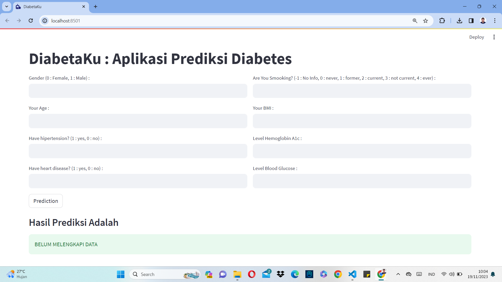
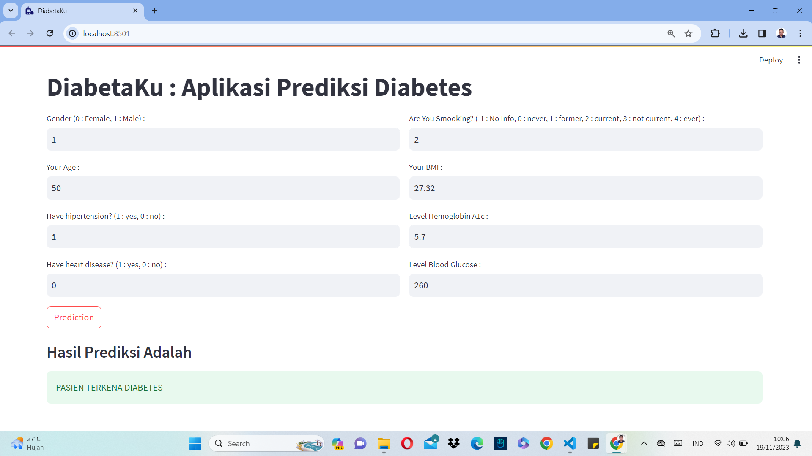

# DiabetaKu : Aplikasi Sistem Prediksi Diabetes

Diabetaku adalah Aplikasi berbasis website yang dapat digunakan untuk memprediksi berdasarkan parameter yang diberikan, apakah seseorang itu terkena diabetes atau tidak. Sistem ini dibangun menggunakan algoritma Support Vector Classifier. Sistem ini memiliki tingkat akurasi sebesar 96% pada data testing dan 95% pada data training. Meskipun memiliki tingkat akurasi yang cukup tinggi, masih dimungkinkan juga terjadinya kesalahan prediksi. Dataset yang diguakan pada sistem ini, dapat diunduh pada link berikut : [KLIK DISINI](https://www.kaggle.com/datasets/iammustafatz/diabetes-prediction-dataset/data)

## Mulai Bekerja

1. Kloning Repositori Ini

```
https://github.com/iqbalpurba26/Sistem-Prediksi-Diabetes.git
```

2. Persiapan Lingkungan

```
conda create --name main-ds python=3.10
conda activate main-ds
pip install joblib streamlit pandas numpy sklearn
```

3. Jalankan Streamlit

```
streamlit run stream_diabetes.py
```

## Screenshot Tampilan Halaman




